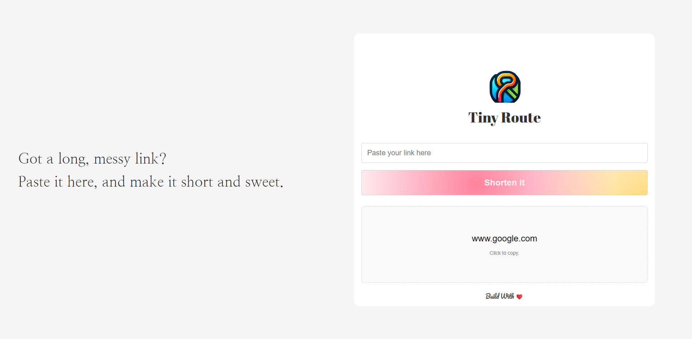
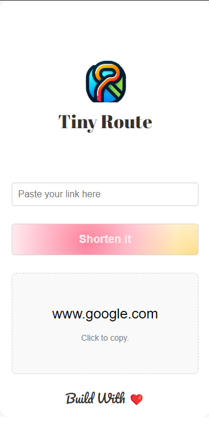

*# TinyRoute
Tiny Route is a URL shortening service that allows users to convert long URLs into short, easy-to-share 




## Project Structure
```
TinyRoute
├── public
|   ├── css
|   |   ├── login.css
|   |   ├── signup.css
|   |   └── style.css
|   ├── js
|   |   ├── login.js
|   |   ├── signup.js
|   |   └── script.js
|   ├── index.html
|   ├── login.html
|   └── signup.html
├── resources
|   ├── images
|   |   └── logo.png
|   └── previews
|       ├── mobile.png
|       └── desktop.png
├── src
|   ├── controller
|   |   ├── AuthController.js
|   |   └── urlController.js
|   ├── middleware
|   |   └── loginCheck.js
|   ├── model
|   |   ├── url.js
|   |   └── user.js
|   ├── routes
|   |   ├── auth.js
|   |   └── urlRoute.js
|   ├── util
|   |   ├── generateSessionId.js
|   |   └── slugGenerator.js
|   ├── app.js
|   └── connectDB.js
├── .env
├── .gitignore
└── package.json
```


## Installation
1. Clone the Repository
```git clone <repository-url>```
2. Navigate to the project directory:
```cd tiny-route```
3. Install the dependencies:
```npm install```

### Configuration
Create a .env file in the root directory and add the following environment variables:
```
PORT=<your-port>
DATABASE_URL=<your-database-url>
```

### Running the Project
To start the server, run:

```npm start    ```


## Project Components

### Backend
- **src/app.js**: Main entry point of the application. Sets up the Express server and connects to the database.
- **src/connectDB.js**: Handles the connection to the MongoDB database.
- **src/controller/urlController.js**: Contains the logic for creating short URLs and retrieving original URLs.
- **src/routes/urlRoutes.js**: Defines the API routes for shortening URLs and retrieving original URLs.
- **src/util/slugGenerator.js**: Utility for generating random strings used as URL slugs.

### Frontend
- **public/index.html**: Main HTML file for the frontend.
- **public/css/style.css**: Stylesheet for the frontend.
- **public/js/script.js**: JavaScript file for handling frontend interactions.

### Models
- **src/model/url.js**: Defines the URL schema for MongoDB.

## API Endpoints

### POST /api/shorten
Creates a new short URL.

- **Request Body**:
  ```json
  {
      "originalUrl": "https://example.com"
  }

- **Response**:
  ```json
  {
      "slug": "abcXYZ"
  }

## GET /api/
Redirects to the original URL based on the provided slug.

### Frontend Functionality
- Users can paste a long URL into the input field and click the "Shorten it" 
-  button to generate a short URL.
- The short URL is displayed in the .short-link element.
- Users can click the short URL to copy it to their clipboard.

## License

This project is licensed under the MIT License.

```
You can save this content as a `.md` file, such as `README.md`. Let me know if you need any adjustments!
```

*